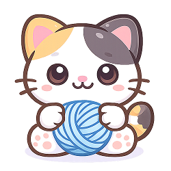

# purrtabby

<p align="center">
  
  <br>
  <a href="https://www.npmjs.org/package/purrtabby"></a>
  
  <a href="https://bundlephobia.com/package/purrtabby"></a>
</p>

> Lightweight browser tab communication and leader election library using BroadcastChannel and localStorage

A lightweight library for cross-tab communication and leader election in browser environments. Perfect for coordinating multiple tabs/windows and electing a single leader tab.

## Highlights

**Microscopic**: weighs 6.3KB minified (2.1KB gzipped)

**Reliable**: leader election with lease-based heartbeat mechanism

**Modern**: async iterables for generator-based message streams

**Type-Safe**: full TypeScript support

**Zero Dependencies**: uses native Browser APIs only (BroadcastChannel, localStorage)

**Flexible**: callback-based or generator-based APIs, your choice

## 🎮 Try It Live

**[Interactive Demo →](https://let-sunny.github.io/purrtabby/)**

Try purrtabby in your browser with our interactive demo. Test cross-tab communication and leader election between multiple tabs.

## 📚 Documentation

**[Architecture Documentation →](./docs/ARCHITECTURE.md)**

Learn about purrtabby's internal architecture and design decisions.

## Features

- **Cross-tab communication** using BroadcastChannel
- **Leader election** with localStorage-based lease and heartbeat
- **Generator-based streams** for async iteration
- **TypeScript** support
- **Browser compatible** (requires BroadcastChannel and localStorage support)
- **Zero dependencies** (uses native Browser APIs)
- **Tiny bundle size**
- **AbortSignal** support for stream cancellation

## Table of Contents

- [Installation](#installation)
  - [Requirements](#requirements)
- [Usage](#usage)
  - [TabBus - Cross-tab Communication](#tabbus---cross-tab-communication)
  - [LeaderElector - Leader Election](#leaderelector---leader-election)
  - [Generator-based Streams](#generator-based-streams)
  - [With AbortSignal](#with-abortsignal)
  - [Callback-based API](#callback-based-api)
- [API](#api)
  - [createBus(options)](#createbusoptions)
  - [createLeaderElector(options)](#createleaderelectoroptions)
- [Examples](#examples)

## Installation

**npm:**

```bash
npm install purrtabby
```

**UMD build (via unpkg):**

```html
<script src="https://unpkg.com/purrtabby/dist/index.global.js"></script>
```

### Requirements

**Runtime:**

- **Browser**: Modern browsers with BroadcastChannel and localStorage support
- **Node.js**: Not supported (requires browser APIs)

**Development:**

- **Node.js**: 24.13.0 (tested with this version)

## Usage

### TabBus - Cross-tab Communication

```typescript
import { createBus } from 'purrtabby';

const bus = createBus({
  channel: 'my-app-channel',
});

// Subscribe to specific message types
const unsubscribe = bus.subscribe('user-action', (message) => {
  console.log('Received:', message.payload);
  console.log('From tab:', message.tabId);
});

// Publish messages to all tabs
bus.publish('user-action', { action: 'click', target: 'button' });

// Subscribe to all messages
bus.subscribeAll((message) => {
  console.log('Any message:', message.type, message.payload);
});

// Cleanup
unsubscribe();
bus.close();
```

### LeaderElector - Leader Election

```typescript
import { createLeaderElector } from 'purrtabby';

const leader = createLeaderElector({
  key: 'my-app-leader',
  tabId: 'tab-1', // Optional: auto-generated if not provided
  leaseMs: 5000, // Lease duration in milliseconds
  heartbeatMs: 2000, // Heartbeat interval
  jitterMs: 500, // Jitter to avoid thundering herd
});

// Start leader election
leader.start();

// Check if this tab is the leader
if (leader.isLeader()) {
  console.log('This tab is the leader!');
}

// Listen for leader events
leader.on('acquire', () => {
  console.log('Became the leader!');
});

leader.on('lose', (event) => {
  console.log('Lost leadership:', event.meta?.newLeader);
});

leader.on('change', (event) => {
  console.log('Leadership changed to:', event.meta?.newLeader);
});

// Stop leader election
leader.stop();
```

### Choosing Between Callback and Generator APIs

purrtabby provides two ways to consume messages and events: **callbacks** and **generators**. Choose based on your needs:

- **Callbacks**: Simple, event-driven, good for one-off handlers
- **Generators**: Modern async/await patterns, better for complex flows, supports AbortSignal

### Callback-based API

```typescript
const bus = createBus({ channel: 'my-channel' });

// Subscribe to specific message types
const unsubscribeMessage = bus.subscribe('user-action', (message) => {
  console.log('Message:', message.payload);
});

// Subscribe to all messages
const unsubscribeAll = bus.subscribeAll((message) => {
  console.log('Any message:', message.type, message.payload);
});

// Unsubscribe when done
unsubscribeMessage();
unsubscribeAll();

const leader = createLeaderElector({
  key: 'my-leader',
  tabId: 'tab-1',
});

leader.start();

// Subscribe to specific leader events
const unsubscribeAcquired = leader.on('acquire', (event) => {
  console.log('Became leader');
});

const unsubscribeLost = leader.on('lose', (event) => {
  console.log('Lost leadership');
});

// Subscribe to all leader events
const unsubscribeAllEvents = leader.onAll((event) => {
  console.log('Leader event:', event.type);
});

// Unsubscribe when done
unsubscribeAcquired();
unsubscribeLost();
unsubscribeAllEvents();
```

### Generator-based Streams

```typescript
const bus = createBus({ channel: 'my-channel' });

// Consume messages as async iterable
(async () => {
  for await (const message of bus.stream()) {
    console.log('Received:', message.type, message.payload);
  }
})();

const leader = createLeaderElector({
  key: 'my-leader',
  tabId: 'tab-1',
});

leader.start();

// Consume leader events as async iterable
(async () => {
  for await (const event of leader.stream()) {
    console.log('Leader event:', event.type, event.ts);
  }
})();
```

### With AbortSignal

```typescript
const controller = new AbortController();

(async () => {
  for await (const message of bus.stream({ signal: controller.signal })) {
    console.log(message);
    if (shouldStop) {
      controller.abort();
    }
  }
})();
```

## API

### `createBus(options)`

Creates a new TabBus instance for cross-tab communication.

#### Options

| Option    | Type     | Default        | Description           |
| --------- | -------- | -------------- | --------------------- |
| `channel` | `string` | **required**   | BroadcastChannel name |
| `tabId`   | `string` | auto-generated | Unique tab identifier |

#### TabBus Methods

##### `publish(type, payload?)`

Publishes a message to all tabs listening on the same channel.

```typescript
bus.publish('user-action', { action: 'click' });
```

##### `subscribe(type, handler)`

Subscribes to messages of a specific type. Returns an unsubscribe function.

```typescript
const unsubscribe = bus.subscribe('user-action', (message) => {
  console.log(message);
});
```

##### `subscribeAll(handler)`

Subscribes to all messages regardless of type. Returns an unsubscribe function.

```typescript
const unsubscribe = bus.subscribeAll((message) => {
  console.log(message);
});
```

##### `stream(options?)`

Returns an async iterable of all messages.

```typescript
for await (const message of bus.stream({ signal: abortSignal })) {
  console.log(message);
}
```

##### `getTabId()`

Returns the current tab's unique identifier.

##### `close()`

Closes the bus and cleans up resources.

### `createLeaderElector(options)`

Creates a new LeaderElector instance for leader election.

#### Options

| Option        | Type           | Default                             | Description                                |
| ------------- | -------------- | ----------------------------------- | ------------------------------------------ |
| `key`         | `string`       | **required**                        | localStorage key for leader lease          |
| `tabId`       | `string`       | **required**                        | Unique tab identifier                      |
| `leaseMs`     | `number`       | `5000`                              | Lease duration in milliseconds             |
| `heartbeatMs` | `number`       | `2000`                              | Heartbeat interval in milliseconds         |
| `jitterMs`    | `number`       | `500`                               | Jitter range to avoid synchronization      |
| `buffer`      | `BufferConfig` | `{ size: 100, overflow: 'oldest' }` | Buffer configuration for stream generators |

**BufferConfig:**

- `size`: Maximum queue size (default: 100)
- `overflow`: Overflow policy - `'oldest'` (drop oldest), `'newest'` (drop newest), or `'error'` (throw error)

#### LeaderElector Methods

##### `start()`

Starts the leader election process.

##### `stop()`

Stops leader election and releases leadership if held.

##### `isLeader()`

Returns `true` if this tab is currently the leader.

##### `on(event, handler)`

Subscribes to a specific leader event. Returns an unsubscribe function.

Events:

- `'acquire'` - This tab became the leader
- `'lose'` - This tab lost leadership
- `'change'` - Leadership changed to another tab

##### `onAll(handler)`

Subscribes to all leader events. Returns an unsubscribe function.

##### `stream(options?)`

Returns an async iterable of leader events.

##### `getTabId()`

Returns the current tab's unique identifier.

## Examples

### Complete Example: Tab Coordination

```typescript
import { createBus, createLeaderElector } from 'purrtabby';

// Set up cross-tab communication
const bus = createBus({ channel: 'my-app' });

// Set up leader election
const leader = createLeaderElector({
  key: 'my-app-leader',
  tabId: `tab-${Date.now()}`,
  leaseMs: 5000,
  heartbeatMs: 2000,
});

// Start leader election
leader.start();

// Handle leader events
leader.on('acquire', () => {
  console.log('This tab is now the leader');
  // Only the leader performs certain tasks
  bus.publish('leader-announcement', { tabId: leader.getTabId() });
});

leader.on('lose', () => {
  console.log('This tab is no longer the leader');
});

// Listen for messages from other tabs
bus.subscribe('user-action', (message) => {
  console.log('User action from tab:', message.tabId, message.payload);

  // If we're the leader, process the action
  if (leader.isLeader()) {
    console.log('Processing action as leader');
  }
});

// Publish user actions
bus.publish('user-action', { action: 'click', target: 'button' });

// Cleanup
leader.stop();
bus.close();
```

### Using with [purrcat](https://www.npmjs.com/package/purrcat) (WebSocket)

> **[📖 Full WebSocket Usage Guide →](./docs/WEBSOCKET-USAGE.md)** - Learn how to share WebSocket connections across tabs, implement request-response patterns, and handle edge cases.

```typescript
import createSocket from 'purrcat';
import { createBus, createLeaderElector } from 'purrtabby';

const bus = createBus({ channel: 'ws-coordinator' });
const leader = createLeaderElector({
  key: 'ws-leader',
  tabId: `tab-${Date.now()}`,
});

leader.start();

// Only the leader maintains WebSocket connection
leader.on('acquire', () => {
  const socket = createSocket({
    url: 'wss://api.example.com/ws',
  });

  // Forward messages from WebSocket to all tabs
  socket.onMessage((message) => {
    bus.publish('ws-message', message);
  });

  // Forward messages from tabs to WebSocket
  bus.subscribe('send-to-ws', (message) => {
    socket.send(message.payload);
  });
});

// All tabs can receive WebSocket messages
bus.subscribe('ws-message', (message) => {
  console.log('WebSocket message:', message.payload);
});

// Any tab can send to WebSocket (leader forwards it)
bus.publish('send-to-ws', { type: 'ping' });
```

## License

MIT
